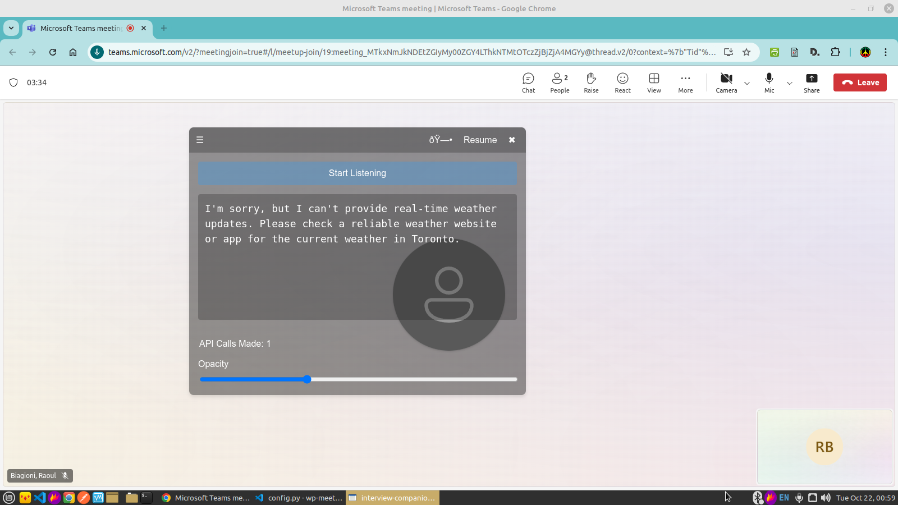

# OpenAI Virtual Teleprompter

Welcome to the **OpenAI Virtual Teleprompter**! This innovative application transforms your spoken words into real-time text, powered by OpenAI's advanced language processing capabilities. Designed for professionals, content creators, and anyone who needs to maintain eye contact while delivering information, this tool acts as a smart, responsive teleprompter that adapts to your speech.

## Introduction

The OpenAI Virtual Teleprompter is not just a transcription tool; it's an intelligent assistant that can help clarify your thoughts, expand on your ideas, and even suggest improvements to your speech in real-time. By leveraging the power of OpenAI's API, it provides a seamless experience for users who need to speak coherently and confidently, whether in virtual meetings, presentations, or content creation sessions.

Key features include:
- Real-time speech-to-text conversion
- Intelligent responses and suggestions from OpenAI
- Customizable floating interface for easy viewing during use
- Ability to pause and resume speech recognition
- Adjustable opacity for the on-screen display

Whether you're a professional speaker looking to improve your delivery, a content creator needing assistance with scripting, or anyone who wants to enhance their verbal communication, the OpenAI Virtual Teleprompter is here to support and elevate your speaking experience.

## Table of Contents

- [Features](#features)
- [Screenshots](#screenshots)
- [Prerequisites](#prerequisites)
- [Installation](#installation)
  - [Backend Setup](#backend-setup)
  - [Frontend Setup](#frontend-setup)
- [Usage](#usage)
  - [Running the Application](#running-the-application)
  - [Interacting with the Assistant](#interacting-with-the-assistant)
- [Configuration](#configuration)
- [Logging](#logging)
- [Testing](#testing)
- [Utilities](#utilities)
- [Contributing](#contributing)
- [License](#license)
- [Acknowledgments](#acknowledgments)

## Features

- **Real-time Audio Capture**: Captures audio from your microphone with adjustable settings for channels, rate, and chunk size.
- **OpenAI Integration**: Sends audio data to OpenAI's API for processing and receives responses.
- **WebSocket Communication**: Utilizes WebSockets for real-time communication between the backend and frontend.
- **Electron Frontend**: Provides a desktop application interface built with Electron and React.
- **Draggable Floating Prompter**: A customizable and movable UI component for displaying assistant responses.
- **Error Handling and Logging**: Comprehensive logging and error handling mechanisms for robust performance.
- **Extensible Architecture**: Modular design for easy extension and integration with other services.

## Screenshots



This screenshot showcases the OpenAI Virtual Teleprompter interface, featuring:
- A "Start Listening" button to begin speech recognition
- A response area displaying the assistant's transcription and suggestions
- An API call counter to track usage
- An opacity slider for adjusting the interface transparency

## Prerequisites

- **Python 3.7+**
- **Node.js 14+**
- **npm**
- **An OpenAI API Key**: You need to have an API key from OpenAI to use their services.
- **PortAudio**: Required for PyAudio installation.
- **PyAudio**: For audio input/output in Python.
- **Electron**: For running the frontend application.

## Installation

### Backend Setup

1. **Clone the Repository**

   ```bash
   git clone https://github.com/yourusername/voice-assistant-application.git
   cd voice-assistant-application/backend
   ```

2. **Create a Virtual Environment**

   ```bash
   python -m venv venv
   source venv/bin/activate  # On Windows use `venv\Scripts\activate`
   ```

3. **Install Python Dependencies**

   Ensure you have PortAudio installed on your system, which is required for PyAudio.

   - On **Ubuntu/Debian**:

     ```bash
     sudo apt-get install libportaudio2
     ```

   - On **macOS** (using Homebrew):

     ```bash
     brew install portaudio
     ```

   Then install the Python dependencies:

   ```bash
   pip install -r requirements.txt
   ```

4. **Set Up Configuration**

   - **Environment Variables**:

     Set the `OPENAI_API_KEY` environment variable:

     - On **Linux/macOS**:

       ```bash
       export OPENAI_API_KEY='your_openai_api_key'
       ```

     - On **Windows**:

       ```cmd
       set OPENAI_API_KEY='your_openai_api_key'
       ```

   - **Configuration File**:

     The `config.py` file contains settings you can adjust:

     - `max_api_calls`: Maximum number of API calls (`-1` for unlimited).
     - `silence_threshold`, `cooldown_duration`: Silence detection settings.
     - `rate`, `channels`, `frame_duration_ms`: Audio settings.

### Frontend Setup

1. **Navigate to the Root Directory**

   ```bash
   cd ../  # Assuming you're in the backend directory
   ```

2. **Install Node.js Dependencies**

   ```bash
   npm install
   ```

3. **Build the Frontend**

   ```bash
   npm run build
   ```

4. **Ensure Electron is Installed**

   If Electron is not installed globally, you can install it as a dev dependency (already included in `package.json`):

   ```bash
   npm install electron --save-dev
   ```

## How the Application Works

The OpenAI Virtual Teleprompter operates through a sophisticated pipeline:

1. **Audio Capture**: The application uses PyAudio to capture real-time audio from your microphone. It's specifically configured for the Logitech Yeti Blue microphone, ensuring high-quality audio input.

2. **Speech Processing**: The captured audio is sent to OpenAI's API, which converts the speech to text and processes the content.

3. **Real-time Display**: The transcribed text and any AI-generated suggestions are immediately displayed on the floating interface, allowing you to read and react in real-time.

4. **Intelligent Assistance**: Beyond mere transcription, the OpenAI API can provide context-aware suggestions, clarifications, or expansions on your speech, enhancing your delivery.

5. **User Interaction**: You can control the application using voice commands or the on-screen interface, allowing you to pause, resume, or adjust settings as needed.

6. **Customizable Interface**: The floating prompter can be moved around the screen and its opacity adjusted, ensuring it doesn't interfere with other applications or your camera during use.

### Usage in Virtual Meetings

When using the OpenAI Virtual Teleprompter during virtual meetings, it's important to note that you'll need to use two microphones:
- One microphone (preferably the Logitech Yeti Blue) for the Teleprompter application
- Another microphone (such as your webcam's built-in mic) for the actual meeting audio

This setup ensures that the Teleprompter can capture your speech without interfering with your meeting audio.

### Interacting with the Teleprompter

- **Start Listening**: Click the "Start Listening" button to begin speech recognition.
- **Voice Input**: Speak naturally; the Teleprompter processes your speech in real-time.
- **Pause/Resume**: Use the spacebar or the on-screen button to control listening.
- **View Transcripts and Suggestions**: Read the real-time transcripts and AI suggestions on the floating interface.
- **Adjust Opacity**: Use the slider to change the transparency of the floating prompter.
- **Reposition**: Click and drag the top bar to move the floating prompter on your screen.

By leveraging these features, you can maintain natural eye contact and body language while having the support of an intelligent, real-time teleprompter.

## Configuration

The application can be customized using the `config.py` file in the `backend` directory.

### Configuration Options

- **API Key and URL**: Set your OpenAI API key and endpoint URL.
- **Audio Settings**:
  - `rate`: Sample rate (default is 48000 Hz).
  - `channels`: Number of audio channels (default is 1).
  - `frame_duration_ms`: Duration of each audio frame in milliseconds.
- **Assistant Settings**:
  - `max_api_calls`: Maximum number of API calls (`-1` for unlimited).
  - `silence_threshold`: Threshold for detecting silence.
  - `cooldown_duration`: Duration to wait before listening again after a response.
  - `instructions`: Instructions or guidelines for the assistant's responses.

### Frontend Configuration

- **Opacity**: Adjusted within the UI using the slider.
- **Keyboard Shortcuts**:
  - **Spacebar**: Toggle pause/resume listening.
- **Window Behavior**:
  - The Electron window is set to always be on top and is transparent, providing an unobtrusive overlay.

## Logging

Logging is configured using the `common_logging.py` module in the `backend` directory. It sets up both file and console logging with options for rotation and formatting.

### Adjusting Logging Levels

You can adjust the logging level in your scripts when initializing the logger:

```python
from common_logging import setup_logging

logger = setup_logging('your_module_name', debug_to_console=True)
```

- **Parameters**:
  - `name`: Name of the logger.
  - `debug_to_console` (bool): If `True`, logs will also output to the console.
  - `filter_response_done` (bool): If `True`, applies a filter to only log specific messages.

### Log Files

- Logs are stored in the `logs` directory within `backend`.
- Each module has its own log file, e.g., `voice_assistant.log`, `openai_client.log`.

## Testing

The `tests` directory contains scripts to verify the functionality of audio devices and API interactions.

### Running Audio Tests

```bash
cd tests
python test_audio.py
```

- This script tests audio recording from your microphone and saves it to `output.wav`.
- Ensure your microphone is properly connected and recognized by the system.
- The script searches for a "Blue Yeti" microphone by default. Modify the device search in the script if you have a different microphone.

### Additional Tests

- **PulseAudio and PyAudio Tests**: `test_pulseaudio_and_pyaudio.py` can help diagnose audio issues on systems using PulseAudio.

## Utilities

### Kill Ports Script

The `utils/kill_ports.py` script checks for processes running on specific ports (e.g., 8000 and 3000) and terminates them. This is useful for ensuring that the required ports are free before starting the application.

#### Usage

```bash
cd utils
python kill_ports.py
```

- The script uses `lsof` to find and kill processes. It may require elevated permissions depending on your system configuration.
- Modify the script if you need to check different ports.

## Contributing

We welcome contributions from the community! To contribute:

1. **Fork the Repository**

2. **Create a Feature Branch**

   ```bash
   git checkout -b feature/YourFeature
   ```

3. **Commit Your Changes**

   ```bash
   git commit -m "Add your message"
   ```

4. **Push to Your Fork**

   ```bash
   git push origin feature/YourFeature
   ```

5. **Create a Pull Request**

   - Navigate to the original repository and open a pull request.

## Environment and Compatibility

The OpenAI Virtual Teleprompter has been developed and tested specifically for the following environment:

- **Operating System**: Linux Mint
- **Microphone**: Configured for Logitech Yeti Blue microphone
- **Platform**: Not cross-platform (currently Linux-specific)

### Important Notes:

1. **Linux Compatibility**: The application is currently optimized for Linux Mint and may not function correctly on other operating systems without modifications.

2. **Microphone Configuration**: While the software is configured for the Logitech Yeti Blue microphone, it may work with other high-quality microphones. However, optimal performance is not guaranteed with other models.

3. **Dual Microphone Setup for Virtual Meetings**: When using the Teleprompter during virtual meetings, you must use two separate microphones:
   - One dedicated to the Teleprompter application (preferably the Logitech Yeti Blue)
   - Another for your meeting audio (e.g., your webcam's built-in microphone)

4. **Performance Considerations**: The application's performance may vary depending on your system specifications and the quality of your audio input.

5. **Future Development**: While currently Linux-specific, future versions may aim for cross-platform compatibility. Contributions towards this goal are welcome!

## License

This project is licensed under the [MIT License](LICENSE).

## Acknowledgments

- **OpenAI**: For providing the powerful API that drives our intelligent teleprompter.
- **Electron**: For the framework that enables our desktop application interface.
- **PyAudio**: For reliable audio input processing in Python.
- **Contributors**: A heartfelt thanks to all who have contributed to this project.
- **Community**: For the ongoing support, feedback, and inspiration.

---

*We welcome your questions, feedback, and contributions! Feel free to open an issue if you need assistance or have suggestions for improvement.*

---

For any additional information or specific sections you'd like to expand upon, please don't hesitate to ask. We're committed to making this README as informative and helpful as possible.
